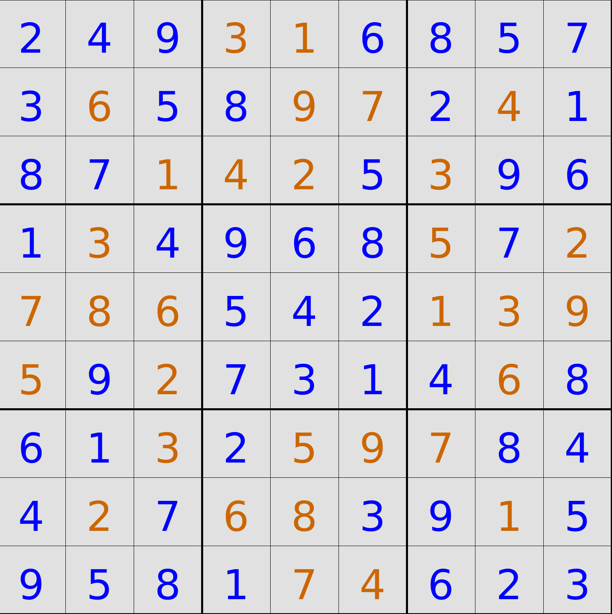

# Sudoku Solver

A high-performance Sudoku solver that encodes puzzles as propositional logic formulas and uses a custom CDCL (Conflict-Driven Clause Learning) SAT solver to find solutions. This project demonstrates the power of SAT solvers in solving constraint satisfaction problems and includes support for batch solving large puzzle sets in parallel.



## Table of Contents

- [Overview](#overview)
- [How It Works](#how-it-works)
- [Compilation & Execution](#compilation--execution)
- [Constraint Encoding](#constraint-encoding)
- [Algorithm Details](#algorithm-details)
- [Performance Features](#performance-features)
- [Puzzle Data](#puzzle-data)

## Overview

This project solves Sudoku puzzles by:
1. **Encoding** the puzzle as a SAT formula in Conjunctive Normal Form (CNF)
2. **Applying** a CDCL SAT solver to find a satisfying assignment
3. **Decoding** the solution back into a grid

The solver successfully handles puzzles ranging from easy to diabolical difficulty.

### Key Features

- **SAT-based approach**: Leverages modern SAT solving techniques (CDCL)
- **Parallel processing**: Solves multiple puzzles concurrently for large datasets
- **Visual output**: Uses Processing library to display puzzles and solutions
- **Custom SAT solver**: Uses custom CDCL implementation for solving

## How It Works

### High-Level Process

1. **Load puzzle**: Read an 81-character Sudoku puzzle string
2. **Encode as CNF**: Create propositional logic constraints representing Sudoku rules
3. **Solve with SAT solver**: Apply CDCL algorithm to find a satisfying assignment
4. **Decode solution**: Convert the solution back to a 9×9 grid
5. **Display/Output**: Visualize the solution or write to file


## Compilation & Execution

### Prerequisites

- Java 21 or higher
- Maven 3.6+

### Compile

```bash
mvn clean compile
```

### Build Executable JAR

```bash
mvn clean package
```

### Run

```bash
mvn exec:java@run-main-class
```

This launches the Processing visualization window displaying the puzzle and its solution.

## Constraint Encoding

### Propositional Variables

For a standard 9×9 Sudoku, the encoding uses:
- **Total variables**: $9 \times 9 \times 9 = 729$ boolean variables
- **Variable assignment**: For cell $(i, j)$ and value $n$: 
  - Variable ID = `(row*9 + col)*9 + (value-1)`
  - `true` means cell $(i,j)$ contains value $n$
  - `false` means cell $(i,j)$ does not contain value $n$

### Constraint Types

The SAT formula includes the following constraint categories, expressed as clauses (disjunctions):

#### 1. **Cell Occupancy Constraints**

Each cell must contain exactly one value:

- **At least one**: For each cell $(i,j)$: $(x_{i,j,1} \vee x_{i,j,2} \vee \ldots \vee x_{i,j,9})$
- **At most one**: For each cell $(i,j)$ and values $a \neq b$: $(\neg x_{i,j,a} \vee \neg x_{i,j,b})$

#### 2. **Row Constraints**

Each value 1-9 appears exactly once per row:

- **At least one**: For row $i$ and value $n$: $(x_{i,0,n} \vee x_{i,1,n} \vee \ldots \vee x_{i,8,n})$
- **At most one**: For row $i$, value $n$, and positions $a \neq b$: $(\neg x_{i,a,n} \vee \neg x_{i,b,n})$

#### 3. **Column Constraints**

Each value 1-9 appears exactly once per column:

- **At least one**: For column $j$ and value $n$: $(x_{0,j,n} \vee x_{1,j,n} \vee \ldots \vee x_{8,j,n})$
- **At most one**: For column $j$, value $n$, and positions $a \neq b$: $(\neg x_{a,j,n} \vee \neg x_{b,j,n})$

#### 4. **Box Constraints**

Each value 1-9 appears exactly once per 3×3 box:

- **At least one**: For each 3×3 box and value $n$, all 9 cells in that box must contain at least one occurrence of $n$
- **At most one**: For each 3×3 box and value $n$, no two cells can both contain $n$

#### 5. **Initial Grid Constraints**

For each pre-filled cell with value $v$:
- Unit clause: $(x_{i,j,v})$ forces that cell to have value $v$

### Example: 3×3 Box Constraint

For the top-left 3×3 box and value 5:
- At least: $(x_{0,0,5} \vee x_{0,1,5} \vee x_{0,2,5} \vee x_{1,0,5} \vee x_{1,1,5} \vee x_{1,2,5} \vee x_{2,0,5} \vee x_{2,1,5} \vee x_{2,2,5})$
- Pairwise: $(\neg x_{0,0,5} \vee \neg x_{0,1,5})$, $(\neg x_{0,0,5} \vee \neg x_{0,2,5})$, etc.

## Algorithm Details

### SAT Solver: CDCL

The project uses a **Conflict-Driven Clause Learning (CDCL)** SAT solver, this utilises:

1. **Unit Propagation**: Assigns values to variables forced by unit clauses (single-literal clauses)
2. **Implication Graph**: Tracks variable assignments and their dependencies
3. **Conflict Detection**: Identifies when assignments lead to contradictions
4. **Backjumping**: When conflicts occur, backtracks to the most recent decision responsible for the conflict (non-chronological backtracking)
5. **Clause Learning**: Learns new clauses from conflicts to avoid repeating the same error


### Solution Extraction

Once the SAT solver finds a satisfying assignment:
1. Extract all positive literals
2. For each positive literal, decode the cell position and value
3. Construct the 9×9 solution grid
4. Return the completed grid

## Performance Features

### Parallel Puzzle Solving

The project includes the `solveSodokuThread` class for concurrent solving:

```java
ExecutorService executor = Executors.newFixedThreadPool(numThreads);
List<Future<String>> futures = new ArrayList<>();

for (String puzzle : puzzles) {
    futures.add(executor.submit(new solveSodokuThread(puzzle, hash)));
}
```


## Puzzle Data

### Source

All puzzle files sourced from the [Sudoku Exchange Puzzle Bank](https://github.com/grantm/sudoku-exchange-puzzle-bank)

### Format

Each puzzle is represented as an 81-character string:
- `1-9`: Given clues
- `0`: Empty cells to fill

Example:
```
40000080503000000000070000002000006000008030000050100000600203000040300400802000
```

## SAT Solver

- **CDCL Solver**: This project uses my own custom [CDCL SAT Solver](https://github.com/waqeezaman/CDCL2)